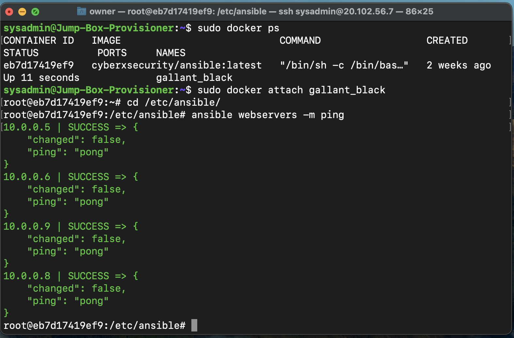

## Automated ELK Stack Deployment

The files in this repository were used to configure the network depicted below.

These files have been tested and used to generate a live ELK deployment on Azure. They can be used to either recreate the entire deployment pictured above. Alternatively, select portions of the playbook file may be used to install only certain pieces of it, such as Filebeat.

This document contains the following details:
- Description of the Topology
- Access Policies
- ELK Configuration
   - Beats in Use
   - Machines Being Monitored
- How to Use the Ansible Build

### Description of the Topology

The main purpose of this network is to expose a load-balanced and monitored instance of DVWA, the D*mn Vulnerable Web Application.

Load balancing ensures that the application will be highly available, in addition to restricting access to the network. Load balancers protect the servers from denial of service attack. It also distributes traffic between the servers.
A JumpBox protects your VMs from public exposure. It provides an additional layerof security  from the public internet by controlling acces to the other machines by allowing connections from specific IP addresses.

Integrating an ELK server allows users to easily monitor the vulnerable VMs for changes to the log files and system performance.
 
Filebeat is installed as an agent on th servers, it monitors the log files or locations that you specify, collects log events and forwards them either to Elastisearch or Logstash for indexing.

Metribeat takes the metrics and statistics that it collects and ships them to the output you specify. It helps monitor your servers by collecting metrics from the system and the services running on the server.

The configuration details of each machine may be found below.
_Note: Use the [Markdown Table Generator](http://www.tablesgenerator.com/markdown_tables) to add/remove values from the table_.

| Name     | Function | IP Address | Operating System |
|----------|----------|------------|------------------|
| Jump-Box | Gateway  | 10.0.0.4   | Linux            |
| WEB-1    | WEB SER  | 10.0.0.5   | Linux            |
| WEB-2    | WEB SER  | 10.0.0.6   | Linux            |
| WEB-3    | WEB SER  | 10.0.0.9   | Linux            |
| WEB-4    | WEB SER  | 10.0.0.8   | Linux            |
| ELK-VM1  | Monitor  | 10.1.0.4   | Linux            |          
### Access Policies

The machines on the internal network are not exposed to the public Internet. 

Only the JumpBox machine can accept connections from the Internet. Access to this machine is only allowed from the following IP addresses:
98.164.160.239- my personal machine

Machines within the network can only be accessed by port 22.
Only the JumpBox has access to the ELK VM 10.1.0.4. It can SSH into the Web servers and Elk servers.

A summary of the access policies in place can be found in the table below.

| Name     | Publicly Accessible | Allowed IP Addresses |
|----------|---------------------|----------------------|
| Jump Box |      YES            |   20.102.56.7
| WEB-VMs  |      NO             |   10.0.0.5-9         |
| ELK-VM1  |      NO             |   10.1.0.4           |

### Elk Configuration

Ansible was used to automate configuration of the ELK machine. No configuration was performed manually, which is advantageous because...
Ansible can be run from the command line and will ensureour provisioning scripts run identically everywhere.

The playbook implements the following tasks:
- Install docker.io
- Download and launch a docker elk stack
- Install python-pip
- Incrreasing memory of the machine

The following screenshot displays the result of running `docker ps` after successfully configuring the ELK instance.

### Target Machines & Beats
This ELK server is configured to monitor the following machines:
| WEB-1 10.0.0.5  
| WEB-2 10.0.0.6         
| WEB-3 10.0.0.9       
| WEB-4 10.0.0.8 

We have installed the following Beats on these machines:
Filebeat
Metricbeat

These Beats allow us to collect the following information from each machine:
Filebeat collects linux logs. Which allows us to track logon events, service start and stops. Also failed access attempts.
Filebeat is used to send your log files to Kibana. Filebeeat monitors and collects log events on specified servers.
Metricbeat collects system metrics from the web servers. It looks for drive space usage, drive space avilable for each host and memory usage.

### Using the Playbook
In order to use the playbook, you will need to have an Ansible control node already configured. Assuming you have such a control node provisioned: 

SSH into the control node and follow the steps below:
- ssh sysadmin@20.102.56.7
- Copy the filebeat-config.yml file to /etc/ansible/files/
- Update the host file to include web servers  to their server groups for the Ansible Playbooks
  WEB SERVERS: 10.0.0.5, 10.0.0.6, 10.0.0.9, 10.0.0.8
  
-To run the playbooks and install Elk, Filebeat, and Metricbeat run the following commands:
cd /etc/ansible
ansible-playbook elk-playbook.yml
ansible-playbook filebeat-playbook.yml
ansible-playbook metricbeat-playbook.yml

Then:

- Run the playbook, and navigate to http://[ELK-VM.IP]:5601/app/kibana to check that the installation worked as expected. 

- Which file is the playbook? 
  The filebeat-config.yml
- Where do you copy it?
  cp /etc/ansible/
- Which file do you update to make Ansible run the playbook on a specific machine? 
  update filebeat-config.yml
- How do I specify which machine to install the ELK server on versus which to install Filebeat on?
  specify which machine to install by updating the host files with IP addresses of the WEB/ELK servers and selecting which group to run on Ansible.
  
  Commands needed to run the Ansible Configuration for Elk-Server are:
  
  ssh sysadmin@20.102.56.7
  
  apt-get update
  
  sudo docker container lis -a
  
  sudo sysremctl status docker
  
  sudo docker start gallant_black
  
  sudo docker ps
  
  sudo docker attach gallant_black
  
  cd /etc/ansible/host
  
  ansible-playbook my-playbook.yml
  
  Then navigate to navigate to http://[ELK-VM.IP]:5601/app/kibana to check that the installation worked as expected. 

